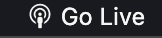
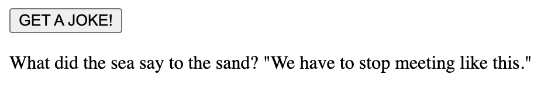

# Kurs i API !!
Hei, alle sammen. Dette er et kurs og et lite sånn info ark om API, hvordan man setter det opp og alt sånn. under har jeg laget en liten oversikt over alt av ting jeg skal gjøre, så les deg litt opp på API-er, jobb med starts oppgaven også kan du bestemme litt selv hvordan du vil fortsette !! 

- [Kursi i API !!](#Kurs-i-API-!!)
  - [Kjapt, hva er en API?](#kjapt-hva-er-en-api-)
  - [Hvordan sette opp og bruke en API](#hvordan-sette-opp-og-bruke-en-api)
    - [Start !!](#start-)
    - [Videre (JavaScript)](#videre-javascript)
  - [Jobbe videre](#jobbe-videre-)
    - [Et lite profesjonellt fullstack prosjekt](#et-lite-profesjonellt-fullstack-prosjekt)
    - [Start med frontend](#start-med-frontend)
    - [Backend og API tilkobling](#backend-og-api-tilkobling)
- [Tips og fortsettelse!](#tips-og-fortsettelse-)
- [Andre API-er](#andre-api-er)

## Kjapt, hva er en API ?
Før vi begynner å se på koden, skal vi se litt på hva en API er for noe.

**Eksempel:**
Tenk deg at du sitter på en restaurant og ønsker mat. Du trenger ikke gå inn på kjøkkenet og lage maten selv - i stedet gir du bestillingen din til servitøren. Servitøren tar bestillingen din til kjøkkenet, henter maten når den er klar, og bringer den tilbake til bordet ditt.

Det under er en forklaring på hva vi skal lage, utifra eksempelet:

1. **Bestillingen:** Du bruker en nettside, og trykker på knappen "GET A FACT !!"
2. **Servitør(API):** Nettsiden sender en forespørsel til __[MeowFacts](https://meowfacts.herokuapp.com/)__ gjennom en API
3. **Kjøkkenet:** __[MeowFacts](https://meowfacts.herokuapp.com/)__ finner frem den dataen du trenger
4. **Serveringen:** API-en leverer dataen tilbake til nettsiden, som viser det på nettsiden 

Nå som vi kan API-er enda litt bedre, kan vi starte på oppsettet !

## Hvordan sette opp og bruke en API 
Her har jeg laget en liten tutorial til hvordan man setter opp **frontend** og kobler til en **api** og lager sitt eget lille proskjekt !!

### Start !! (HTML)
Opprett en ny mappe i **vscode**, inni mappen lager du to filer:
- En `index.html`-fil, her vil vi vise hva API-en gir oss 
- En `script.js`-fil, der vi setter opp API-en vår 
    
```src
└── kurs-i-api/
    ├── index.html
    ├── script.js
```

I html filen, lager du en enkel nettside hvor API-en kan printes ut.

```html
<body>
    <button id="button" class="button">GET A FACT !!</button>
    <p id="fact-line"></p>

    <script src="script.js"></script> <!-- husk og koble til script-et -->
    
</body>
```

### Videre (JavaScript)

Videre, starter vi på script-et, hvor vi skal sette opp API-en. Vi starter ved å lage en variabel som vi skal lagrere faktaene i, og printes ut tilslutt:

```js
let currentFact = ''; //variabel for å lagre faktaen 
```

Så, lager vi en `addEventListener` til knappen, får å starte funskjonen når vi trykker den 

```js
document.querySelector("#button")?.addEventListener("click", fetchFact); 
```

Til slutt lager vi en async funksjon, for prosessen til API-en. Og vi setter resten av koden sammen:

```js
let currentFact = ''; 

document.querySelector("#button")?.addEventListener("click", fetchFact); 
async function fetchFact() { // en async funksjon 
  try {
    console.log("Button was pressed"); // skjekker om knappen responderer 
    const response = await fetch('https://meowfacts.herokuapp.com/'); // fetch en fakta
    
    if (!response.ok) { // skjekker om responsen er ok
      throw new Error('Failed to fetch cat fact');
    }
    const data = await response.json(); // konverterer responsen til json
    currentFact = data.data[0]; // API-en retunerer dataen og lagrer den i variablen 
    document.getElementById("fact-line").textContent = currentFact; // og printer den !!

  } catch (error) {
    console.error(error);
  }
}
```

Det er egentlig alt du trenger, da er det bare og kjøre programmet ditt å **klikke knappen !!**



Og **BOOMMMM!!!**

 

## Jobbe videre !!

Her kan du velge litt selv hva du vil fortsette med. Hvis du trykker [her!](#tips-og-fortsettelse-), kan du bytte API url-en i koden din og bruke andre API-er til nettsiden !! (f.eks. en hunde-bilde API ??? )

Ellers så kan du fortsette til noe litt vanskligere hvor vi utforsker noe lignene, bare at vi bruker en backend løsing for API-en vår **(dette kan være veldig relevant til din fremtid som VG2IT elev ..**).

### Et lite profesjonellt fullstack prosjekt 
Så, nå har du kanskje laget og satt opp en enkel API tilkobling, men hvis du har lyst og prøve deg på noe litt mer avasnert og proffesjonelt har jeg laget en liten tutorial her til hvordan man setter opp **frontend** og **backend**, og koble til en **api** får og lager sitt egne lille fullstack proskjektt !!

> Et fullstack proksjekt er et proskjekt som innholder en front-end og en back-end løsning. Front-end er fremsiden, hvor klienten (du, eller jeg) kommer til, og kan trykke på og se. Back-end er det som skjer "bak kulllissene", her behandler man dataen, logikken og kjører f.eks en API !

### Vikitge dependencies (før vi starter) !!
Last ned brew også node:
```bash
# brew installering 
/bin/bash -c "$(curl -fsSL https://raw.githubusercontent.com/Homebrew/install/HEAD/install.sh)"

# node installering !
# først nvm
curl -o- https://raw.githubusercontent.com/nvm-sh/nvm/v0.40.3/install.sh | bash

# så node.js
nvm install 22
```

### Start med frontend 
Opprett en ny mappe, inni mappen lager du tre filer:
- En `index.html`-fil 
- En `script.js`-fil, for å lage en endpoint for API-en
- En `server.js`-fil, backend-en der vi lager en GET request 
    
```src
└── kurs-i-api/
    ├── index.html
    ├── script.js
    ├── server.js
```
Lag en basic nettside, med en knapp og en `<p>` tag. Akkurat som vi gjorde over.

`<p>`taggen skal være hvor API dataen vises, så lag en id du kaller "punchline" sånn som under ↓.

```html
<body>
    <button id="button" class="button">GET A JOKE!</button>
    <p id="punchline"></p>

    <script src="script.js"></script> <!-- her kobler du til script-et -->
</body>
```

Videre setter vi opp endepunktet, hvor API-en sender dataen (altså vitsen). 

Får å starte prosessen, må vi koble til knappen vi lagde på index siden.Først lager vi en funskjon for å skjekke om knappen svarer når vi klikker på den:
```js
document.getElementById("button").addEventListener("click", function () {
    console.log("Button was pressed");
});
```
Dermed lager vi ende punket hvor vi vil at API-en skal sende dataen. 

```js
document.getElementById("button").addEventListener("click", function () {
    console.log("Button was pressed");

    fetch('http://localhost:5500') // en fetch request som kobler til API-en på maskinen 
       .then(response => { // skjekker den om responsen vi får tilbake er gyldig
            if (!response.ok) {
                throw new Error('Error fetching joke');
            }
            return response.json(); // hvis dataen er gyldig, konverter den det til JSON format
        })
        .then(data => { // så, console logger den vitsen, og den printes ut på siden !!
            console.log(data.joke); 
            document.getElementById("punchline").textContent = data.joke; 
        })
        .catch(error => { // hvis dette ikke går, så printes denne erroren :(((
            console.error('error', error);
        });
});
```
Det er all av frontend-en vi trenger, så videre skal vi nå sette opp selve API-en.

### Backend og API tilkobling 

Åpne `server.js` scriptet du lagde, fordi det er her vi skal koble til API-en vår.

Får å få API-en til å fungere, må vi ha noen nødvendige biblioteker:
```js
const express = require('express');
const bodyParser = require('body-parser');
const cors = require('cors');
```
Får at de skal fungere i koden, må du dermed skrive disse kommandoene inn i terminalen: 
```bash
# express installering 
npm install express 

# body-parser installering
npm install body-parser

# cors installering 
npm install cors 
```
Så når det er gjort, kan vi starte på oppsettet.

Vi bruker **express** til å lage en ny express-applikasjon, og vi velger hvilke port vi skal sende daten til.

```js
const app = express();
const port = 5500; 
```

Videre, legger vi til viktige verktøy som vi trenger for å se dataen i JSON format. Uten dette klarer vi ikke å lese hva API-en sender.

```js
app.use(bodyParser.json());
app.use(bodyParser.urlencoded({ extended: false }));
app.use(cors());  
```

Etter og ha gjort forarbeidet, er det påtide og sette opp selve API-en !!

Vi sender en GET request til API-en vår, fordi vi vil ha noe tilbake. 
```js
app.get('/', async (req, res) => { // vi skriver '/' for å vise hvor dataen skal sendes 
    try {
        const response  = await fetch('https://icanhazdadjoke.com/', { // API-EN !!!
            headers: {
                'Accept': 'application/json', // spesifiserer hvilke data vi vil ha (JSON)
                'User-Agent': 'Dad joke API'
            }
        });
        if (!response.ok) { // skjekker om requesten var velykket 
            throw new Error('Network response was not ok');
        }

        const data = await response.json(); // konverter daten til JSON
        res.json({ joke: data.joke }); // sender videre repsonsen til oss !! 

    } catch (error) { // error hvis det skjer noen feil :(((
        console.error('Error fetching joke:', error);
        res.status(500).json({ error: 'Failed to fetch joke' });
    }
});
```

Så, vil vi gjerne ha en melding som sier ifra når serveren runner, og API-en fungerer:
```js
app.listen(port, () => { // ser om dataen blir sendt, og sier ifra at serveren runner !! 
    console.log(`Server running !!`);
  });
```

Åpen terminalen inni `server.js` og skriver inn:
```bash
# for å starte serveren vår 
node server.js 
```
Så går du til `index.html` og trykker på GO LIVE, trykk på knappen og se hva som skjerr !!



**OG BOOM !!** Du er ferdig med oppsettet så nå er det bare og be til gudene om at det fungerer og at vi ikke for noen errors 🙏 🙏 🙏

## Tips og fortsettelse !
- Hvis du har problemer, kan du se på filene jeg har laget og kopiere inn !! (de skal være 100% rikitge !!)
- Eller si ifra så kan jeg hjelpe dere 

## Andre API-er
- Finn en annen API og skjekk hva som skjer når du bytter ut URL-en med en av disse:
    - https://api.chucknorris.io/jokes/random → ChuckNorrisJoke-API
        - Her må du endre på hva slags data du mottar: 
        ```js
            const data = await response.json(); 
            currentFact = data.value;  // right herer !!!
            document.getElementById("fact-line").textContent = currentFact; 
        ```
    - https://dog.ceo/api/breeds/image/random → Dog-API (bilder)
        - Denne kan være litt tricky, men her hvis du vil se bildene må du skrive inn dette også:
        ```js
            const data = await response.json(); 
            currentFact = data.message;  // her, dette må du endre  !! 

            // også dette må du legge til på samme linje rett under !! 
            const imgElement = document.getElementById("dog-image");
            if (imgElement) {
                imgElement.src = currentFacr  ;
                imgElement.alt = "Random dog image";
            } else {
                // Hvis du ikke har et img-element, kan du opprette ett
                const img = document.createElement("img");
                img.id = "dog-image";
                img.src = currentFact;
                img.alt = "Random dog image";
                document.getElementById("fact-line").textContent = ""; // Tøm tekstfeltet
                document.getElementById("fact-line").appendChild(img); // Legg til bildet
            }
        ```
    - https://api.kanye.rest → RandomKanyeQuotes-API
        - Hvis du bruker denne må du endre på denne linjen, til quote i scriptet !!
        ```js
            const data = await response.json();
            currentFact = data.quote; // her !!!
            document.getElementById("fact-line").textContent = currentFact; 
        ```


